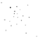

# svg2painting
Convert SVG vector graphics to paintings by rasterizing with brush textures

SVG2Painting           |  Standard Rendering
:---------------------:|:-------------------:
  |  

## Install requirements

```bash
pip install opencv-python
pip install numpy
pip install tqdm
pip install svgpathtools
```
## Basic Usage
`python svg2painting.py -i example.svg -o out.png -r 1024 -b 0`

### Additional options
`python svg2painting.py [-h] [-i INPUT_PATH] [-o OUTPUT_PATH] [-r RESOLUTION] [-b BRUSH] [-t BRUSH_DIRECTORY]`

|Argument| Description|
|:--|:--|
|`-h, --help`| Show this help message and exit.|
|`-i`| Input path. Specify the SVG file you want to be processed.|
|`-o`| Output path. Specify the location of the output file. (i.e. out.png)|
|`-r`| Image resolution. Specify the resolution of the longest side of output image. Aspect ratio will be choose automatically.|
|`-b`| Brush number. [0...44]|
|`-t`| Brush directory. Specify the path where all the brushes live.|
|`-s`| Number of samples per path. Set this higher if strokes don't look continous or lower if the runtime is to long.|

### Available Brushes
| | | | | | | | | | |
|:--:|:--:|:--:|:--:|:--:|:--:|:--:|:--:|:--:|:--:|
 |  |  |  |  |  |  |  |  |  | 
0 | 1 | 2 | 3 | 4 | 5 | 6 | 7 | 8 | 9 | 
 |  |  |  |  |  |  |  |  |  | 
10 | 11 | 12 | 13 | 14 | 15 | 16 | 17 | 18 | 19 | 
 |  |  |  |  |  |  |  |  |  | 
20 | 21 | 22 | 23 | 24 | 25 | 26 | 27 | 28 | 29 | 
 |  |  |  |  |  |  |  |  |  | 
30 | 31 | 32 | 33 | 34 | 35 | 36 | 37 | 38 | 39 | 
 |  |  |  |  | 
40 | 41 | 42 | 43 | 44 | 

### References
- [SLOS-GIMPainter](https://github.com/SenlinOS/SLOS-GIMPainter): That's where all the brushes came from.
- [gimpFormats](https://github.com/TheHeadlessSourceMan/gimpFormats): Was used to convert the brushes to PNG.